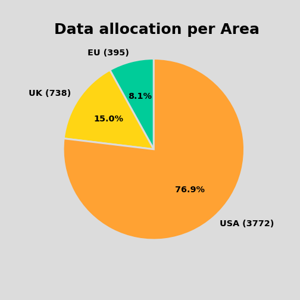
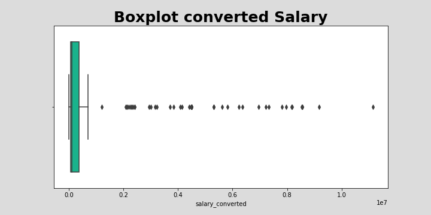
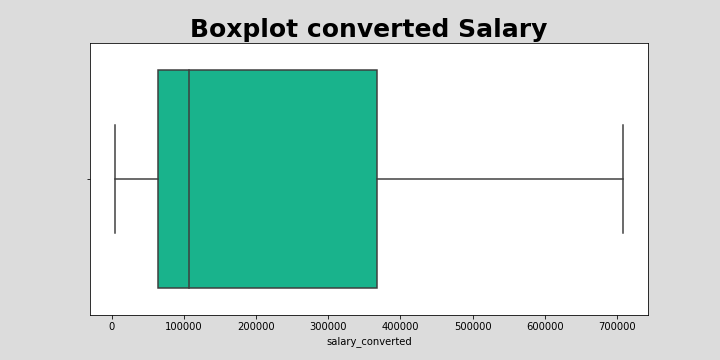
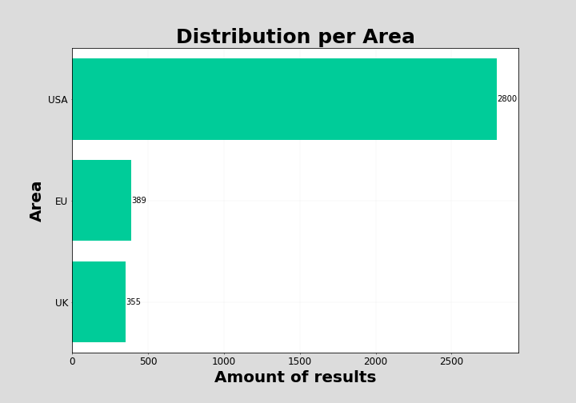

# Indeed job scraping 

During my Immersive Data Science Course at General Assembly I had to create several projects. One of them was a business case to scrape job information online, clean the data and analyse it. 

## Business Case Overview
You're working as a data scientist for a contracting firm that's rapidly expanding. Now that they have their most valuable employee (you!), they need to leverage data to win more contracts. Your firm offers technology and scientific solutions and wants to be competitive in the hiring market. Your principal wants you to

   - determine the industry factors that are most important in predicting the salary amounts for these data.

To limit the scope, your principal has suggested that you *focus on data-related job postings*, e.g. data scientist, data analyst, research scientist, business intelligence, and any others you might think of. You may also want to decrease the scope by *limiting your search to a single region.*

**Goal:** Scrape your own data from a job aggregation tool like Indeed.com in order to collect the data to best answer this question.

---
### Factors that Impact Salary
To predict salary the most appropriate approach would be a regression model.
Here instead we just want to estimate which factors (like location, job title, job level, industry sector) lead to high or low salary and work with a classification model. To do so, split the salary into two groups of high and low salary, for example by choosing the median salary as a threshold (in principle you could choose any single or multiple splitting points).

## Scraping Job information from indeed

### Details for Scraping
I scraped job listings from Indeed using BeautifulSoup and Selenium. I created URLs focusing on the below parameters:
Job descriptions:
- data scientist
- data analyst
- machine learning engineer 

Additionally the scraper was focusing on the following within Europe UK and the US:

- US: New York, Chicago, San Francisco, Austin, Seattle, Los Angeles, Philadelphia, Atlanta, Dallas, Pittsburgh, Portland, Phoenix, Denver, Houston and Miami
- UK: London, Manchester, Birmingham, Glasgow, Liverpool
- EU: Berlin, Hamburg Frankfurt, Paris, Amsterdam, Luxembourg

### Scraper 
My scraper received the URLs as input. Below I will shortly describe the steps of my scraper: 

1. It will use the URL which has been inputted to open a new chrome window of the website and accept the cookies if needed. 
2. If available the following information will be collected for each job listed on the website: 
            - title 
            - location
            - company name
            - salary 
            - salary estimation 
            - link to the specific job offer
3. After all of the jobs are scraped the function will move to the next page and start step 2 to collect the data.  
4. The scraper is saving the data into a data frame.

To avoid captures I include a code snipped which will automatically change the jurisdiction on my local VPN client. 

After the scraping i collected 9084 different jobs.

## Data Cleaning

### Excluding Jobs
the task of the project is to create a classification model for the salary. Unfortunately a lot of jobs didn’t provide any information about the Salary. I excluded directly every job which has no salary information included. After excluding these jobs the allocation looked as below: 

Unfortunately this already reduces my dataset from 9084 results to 4905. The biggest amount of jobs included are from the USA. This is not surprisingly as the US indeed website provides also the salary estimation. For the other indeed websites from Europe and the UK this was not included. 

### Location information
For the location of the jobs I adjusted the information with regex to only include the city names which I used for my scraper. 

### Salary Information
For the salary data the following cleaning and adjustments had been performed
- converting periodic salaries into annual salaries
- converting ranges into median value
- converting the information into floats
- excluding jobs for which no salary information was available
- converting salaries into GBP to make them comparable

The task within the data science course was to predict a binary variable of the salary. The median of the salary should be used as border between high and low salaries. 

After excluding some outliers I create a new column to separate the salaries between the two classes high and low. 

## EDA

During the EDA process it showed that the calculated salaries including some outliers as seen below: 

I filtered the salaries based on the IQR of the data. The result looked much better: 

After adjusting the Salary selection the data included 3544 results. Within a next step I had a look at the location.

Most of the result are form USA, this was not surprisingly as on the US indeed website within most of the cases a salary estimation or information as included. Also looking at the distribution per city we can see that us/cities are showing much more results. 

## Modelling 
 

For the classification modelling I used logistic regression, decision tree classifier, random forest classifier and KNeighbors classifier. I combined the models always with a gridsearch to find the best results. 

Within a first modelling process I only used the location of the jobs to estimate the class of the salary. Afterwards I also included an additional feature. I analysed the job description for the words “junior”, “senior” and “manager”. For the second modelling the additional features had been included. 

One of the restrictions of the project was that a potential boss would rather tell a client incorrectly that they would get a lower salary job than tell a client incorrectly that they would get a high salary job. Because of this I focus on the class 1 which is representing the high salaries. For the evaluation i used simple the precision and ROC/AUC curve and precision recall curve.

| Model | Features | Precision | ROC AUC | Precision-recall AUC |
| --- | --- | --- | --- | --- |
| Logistic regression | only location | 0.64 | 0.75 | 0.668 | 
| KNeighborsClassifier | only location | 0.64 | 0.74 | 0.660 | 
| RandomForestClassifier | only location | 0.63 | 0.75 | 0.662 | 
| DecisionTreeClassifier | only location | 0.64 | 0.75 | 0.667 |
| Logistic regression | additional features | 0.64 | 0.75 | 0.670 |
| <u>KNeighborsClassifier</u> | <u>additional features</u> | <u>0.65</u> | <u>0.76</u> | <u>0.675</u> | 
| RandomForestClassifier | additional features | 0.63 | 0.75 | 0.671 | 
| DecisionTreeClassifier | additional features  | 0.65 | 0.76 | 0.671 |

The best result brought the KNeighborsClassifier. But the difference are minimal. The precision for the low salary are much better than for the high salary, for these result I refer directly to the notebook. 

Below some results of the classifier: 

## Libraries used 
-	Pandas
-	NumPy
-	sk-learn
-	Matplotlib
-	Seaborn
-	Scipy
-	Selenium
-	BeautifulSoup
